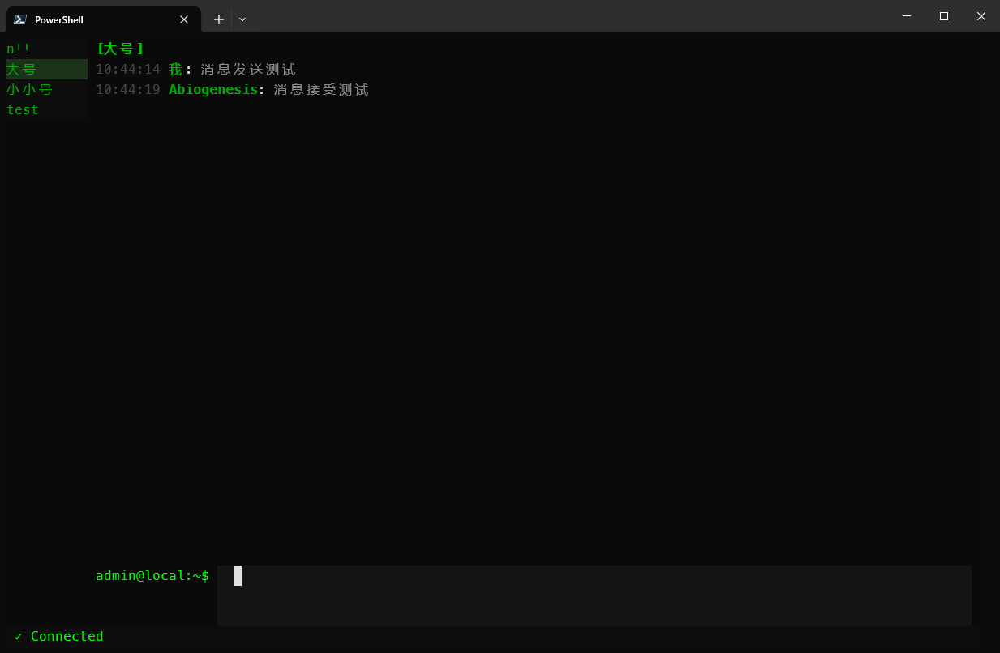
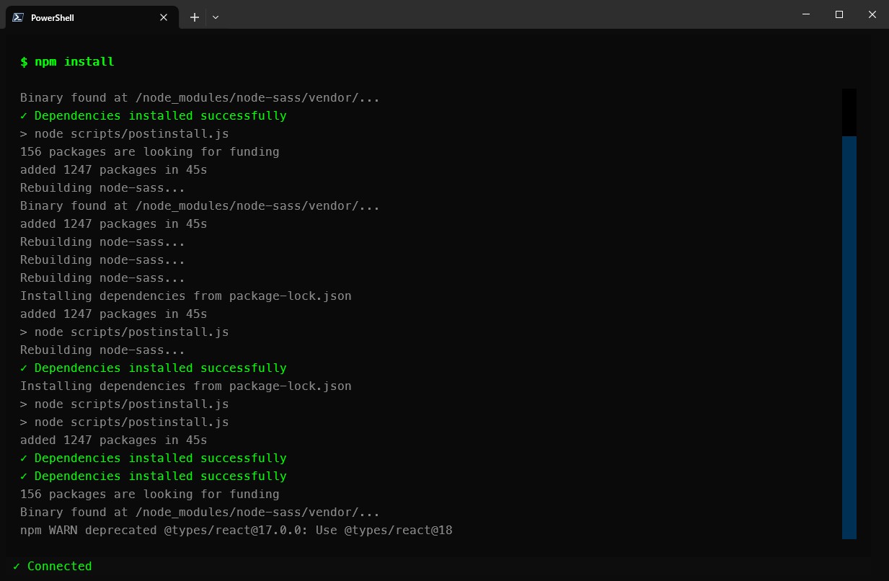

# NapCat Mofish Client

>  终端风格的 QQ 客户端 - 看起来像在写代码，实际在摸鱼

基于 [NapCatQQ](https://github.com/NapNeko/NapCatQQ) (OneBot 11 协议) 的终端 QQ 客户端，使用 Python Textual 框架实现。

## ✨ 特性

-  **视觉伪装** - Hacker 风格配色，看起来像终端工具
-  **老板键** - 一键切换到虚假编译日志
-  **关键词高亮** - 重要消息自动高亮
-  **完整聊天** - 支持私聊和群聊

## 🚀 快速开始

### 前置要求

- Python 3.10+
- [NapCatQQ](https://github.com/NapNeko/NapCatQQ) 已配置并运行

### 安装

```bash
# 使用 uv 安装
uv sync

# 或使用 pip
pip install -e .
```

### 运行

```bash
# 启动客户端
uv run mofish
```

## ⌨️ 快捷键

| 快捷键 | 功能 |
|--------|------|
| `F10` | 老板键 - 切换伪装模式 |
| `Enter` | 发送消息 |
| `↑/↓` | 切换会话 |
| `Ctrl+Q` | 退出程序 |

## 界面展示
聊天界面


老板键伪装界面


## 📝 License

MIT
